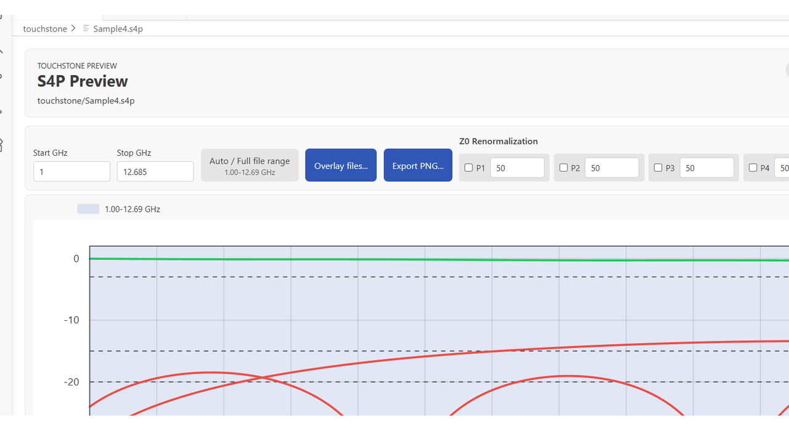
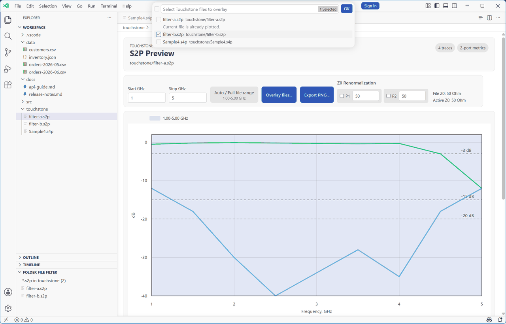

# Touchstone S-Parameter Preview

VS Code extension for quick Touchstone `S`-parameter preview of `.s1p`, `.s2p`, `.s3p`, and `.s4p` RF simulation files.

[Install from VS Code Marketplace](https://marketplace.visualstudio.com/items?itemName=applicate2628.vscode-s2p-preview) | [GitHub repository](https://github.com/applicate2628/vscode-s2p-preview)

## Why Use It

- Inspect Touchstone S-parameter charts without leaving VS Code.
- Compare design variants with overlays, saved presets, and PNG export.
- Keep RF simulation files local; no upload, telemetry, or external service is used.





## Scope

- Supports Touchstone `S`-parameter files in `.s1p`, `.s2p`, `.s3p`, and `.s4p` form.
- Supports Touchstone 1.x option-line files and Touchstone 2.0/2.1 keyword-block files with full matrix network data.
- Renders dB charts for `.s1p`, `.s2p`, `.s3p`, and `.s4p` files.
- Single-file passband metrics are available for 2-port files.
- Plots selected `Sij` traces in dB, with a checkbox matrix for multi-port files.
- Opens `.s1p`, `.s2p`, `.s3p`, and `.s4p` files as the default `S2P Preview` custom editor.
- Opens in `Auto / Full file range` mode and highlights an editable passband.
- Keeps `1-10 GHz` as the first configurable preset.
- Adds and deletes view presets from the preview.
- Renormalizes selected ports to editable per-port real `Z0, Ohm` values in single-file previews.
- Exports the current chart area, including range indicator and legend, to PNG.
- Shows guide lines at `-3 dB`, `-15 dB`, and `-20 dB`.

Unsupported for the current release: `Y`/`Z`/`G`/`H` parameter conversion, mixed-mode transformation UI, and generic high-port `.sNp` visualization.

## Build

```powershell
npm install
npm test
npm run package
```

## Local Commits And Release

Commit normal development changes locally without bumping the extension version. Do not push every local change.

When the current local commit batch is ready to publish, push through the release script. Every push to GitHub must include a version bump:

```powershell
npm run release:patch
```

For Bash environments, use the equivalent script:

```bash
npm run release:patch:bash
```

Both scripts bump the package patch version once for the batch, update the local VSIX filename in this README, run tests, package the extension, run `npm audit`, commit the version bump, and push the current branch to the configured `origin`. They do not hardcode the GitHub owner; forks push to their own `origin`.

## Install Local VSIX

```powershell
code --install-extension .\vscode-s2p-preview-0.0.16.vsix
```

## Use

Open a `.s1p`, `.s2p`, `.s3p`, or `.s4p` file. VS Code should use the `S2P Preview` custom editor by default.

To open the preview from an already-open text editor, run:

```text
S2P: Preview Current File
```

You can also right-click a `.s1p`, `.s2p`, `.s3p`, or `.s4p` file in Explorer and run the same command.
To compare selected files, multi-select Touchstone files in Explorer, right-click, and run `S2P: Preview Selected Files Overlay`.
From an open preview, use `Overlay files...` to pick Touchstone files from the same folder and open an overlay preview.
Use the `Start GHz` and `Stop GHz` fields in the preview to update the shaded band and metrics interactively.
Use the preset dropdown to activate a preset, save the current view as a new preset, or delete a preset with the `x` at the end of its row.
Saved presets are user-level settings, so ranges, visible traces, and Z0 normalization apply across files and workspaces.
To return to the active preset after manual edits, open the dropdown and select that preset again.
Use the `Sij` checkbox matrix to choose visible traces for multi-port files.
Use `Normalize Z0, Ohm` and the port checkboxes to renormalize selected ports; the initial values come from the Touchstone option line or `[Reference]` block.
Use `Export PNG...` to save the current chart area, including the passband range indicator, plotted traces, and visible legend. PNG export uses high-resolution rasterization for sharper lines and labels.

To inspect raw Touchstone text, use `Reopen Editor With...` and choose `Text Editor`.

## Settings

Presets are stored in VS Code settings:

```json
{
  "s2pPreview.passbandPresets": [
    {
      "label": "1-10 GHz",
      "startGHz": 1,
      "stopGHz": 10,
      "traces": [{ "toPort": 2, "fromPort": 1 }],
      "renormalize": {
        "selectedPorts": [false, true],
        "targetOhms": [50, 75]
      }
    }
  ],
  "s2pPreview.defaultPassbandPreset": "Auto / Full file range"
}
```

Preset add/delete actions update user settings by default. If the workspace already defines `s2pPreview.passbandPresets` or `s2pPreview.defaultPassbandPreset`, those actions update the workspace settings instead. Old range-only presets remain valid; presets without `traces` or `renormalize` use the file's default trace visibility and reference impedance.

## Privacy And Security

The extension reads local Touchstone files through the VS Code extension API and renders the preview inside a VS Code webview. It does not upload files, make network requests, or collect telemetry.

## License

Commercial licensing is available separately.
Unless you have a separate commercial license agreement, this project is licensed under MPL-2.0.
See `LICENSE` for the full MPL-2.0 text and `NOTICE` for copyright and commercial licensing notice.

## Terms and Abbreviations

- `MPL`: Mozilla Public License.
- `Bash`: a Unix-style command shell available on Linux, macOS, WSL, and Git Bash.
- `GHz`: gigahertz.
- `mixed-mode`: a network-parameter representation that separates common-mode and differential-mode behavior.
- `PNG`: Portable Network Graphics image format.
- `PowerShell`: Microsoft's command shell used by the default release script on Windows.
- `overlay`: a preview mode that plots one selected S-parameter trace from multiple files on one chart.
- `S2P`: Touchstone two-port `S`-parameter file format.
- `S-parameter`: scattering parameter used to describe RF network behavior.
- `Sij`: one S-parameter trace where `i` is the destination/output port and `j` is the source/input port.
- `SNP`: generic Touchstone N-port `S`-parameter file extension family such as `.s1p`, `.s2p`, `.s3p`, or `.s4p`.
- `Touchstone 1.x`: option-line Touchstone syntax without Touchstone 2.x keyword blocks.
- `Touchstone 2.x`: keyword-block Touchstone syntax for extended network data.
- `Telemetry`: automatic usage or diagnostic data collection; this extension does not collect it.
- `VS Code`: Visual Studio Code.
- `VS Code extension API`: the local API surface VS Code exposes to extensions.
- `VSIX`: the packaged install format for VS Code extensions.
- `webview`: an isolated VS Code panel used to render extension HTML content.
- `Y`/`Z`/`G`/`H`: admittance, impedance, inverse hybrid, and hybrid network-parameter families.
- `Z0`: reference impedance.
